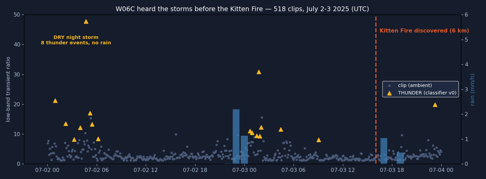
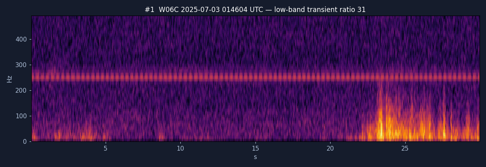
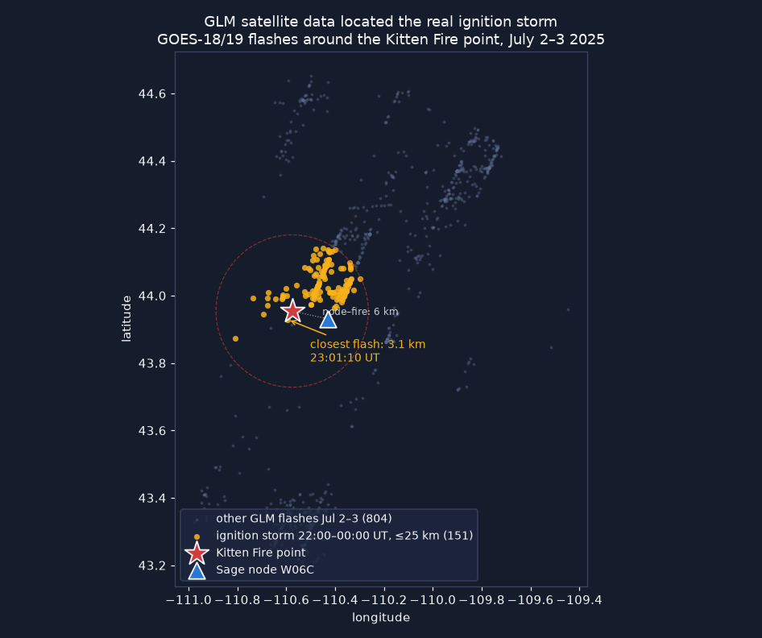
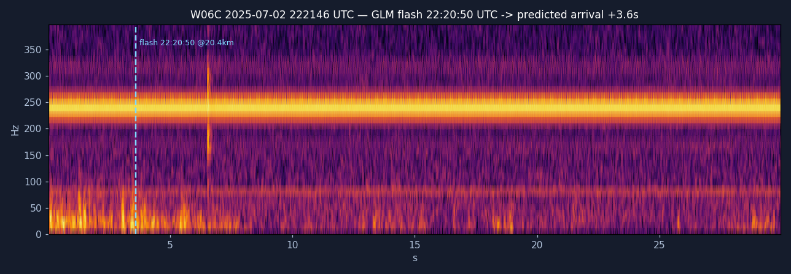
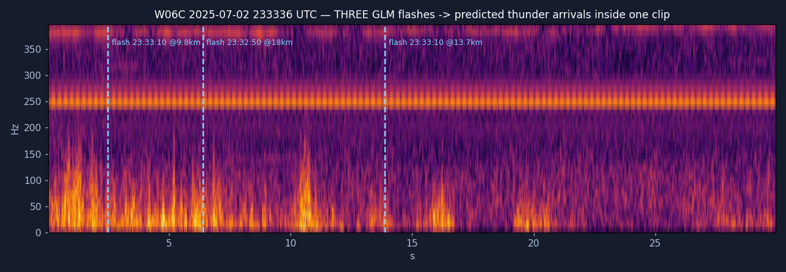
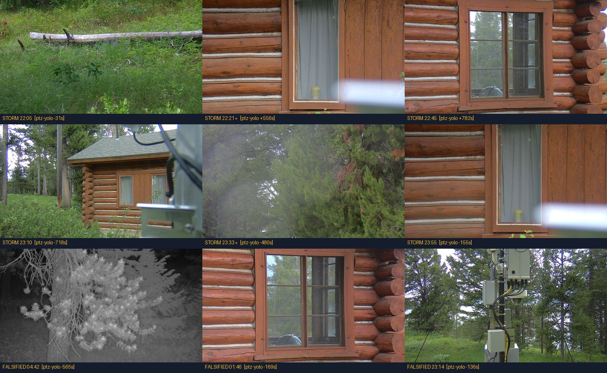
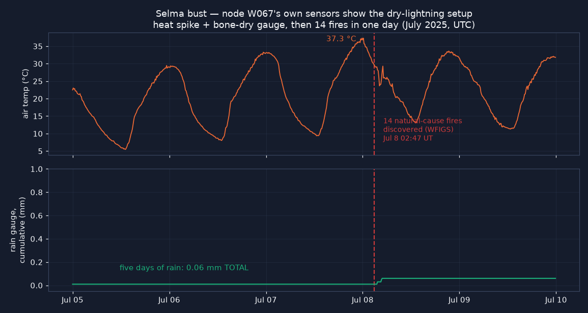

# FlashPoint — Lightning Localization & Wildfire Ignition Watch on the Sage Testbed

**Sage Summer Camp 2026 · Samuel Watson (UH Mānoa / HCDP) · Sage user `scwatson` · camp blade H03E**

FlashPoint turns the Sage fleet's *existing* cameras, microphones, and weather
stations into a lightning-detection and wildfire ignition-watch system — no new
hardware required. Weather feeds arm the nodes ahead of a storm, the sky camera
gives each node a free absolute time-zero (the flash), the microphone gives
range (flash-to-bang), multi-node geometry gives location, and every strike
becomes a multi-day holdover-fire watchpoint with camera smoke monitoring and
human-reviewed risk notifications.

---

## What the system can do

- **Detect lightning on commodity node sensors.** A noise-adaptive,
  spectrally-whitened thunder detector finds thunder onsets even in rain noise;
  a scene-luminance flash detector uses the sky camera as a photometer (no
  aiming needed) and assigns fisheye azimuth sectors.
- **Localize strikes without clock synchronization.** Light arrives
  effectively instantly, so each node's flash→bang delay is a self-clocked
  range (`r = Δt × c_sound`). Ranges from several nodes trilaterate the strike
  with an honest uncertainty ellipse; GDOP/degeneracy gating reports
  `fix | ambiguous | range-only` and never over-claims.
- **Arm itself before the storm.** A tiered controller
  (IDLE→OUTLOOK→APPROACH→STORM→AFTERMATH) escalates capture from free NWS
  outlooks through radar cell tracks to continuous storm capture, with
  guardrails (daily budget, storm-hour cap, timeouts, hysteresis) and a full
  audit trail. On a replay of the real ignition storm it armed **145 minutes
  before the first local flash**.
- **Watch every strike for holdover fire.** A risk-ranked patrol skill re-aims
  a PTZ camera through recent strike sectors on a revisit schedule, ships
  before/after evidence pairs (raw frames never modified; overlays only on
  derived copies), and scores each strike for ignition risk (rain at the node,
  soil/fuel dryness from NASA POWER, fuel type, detection confidence).
- **Keep a human in the loop.** Alerts land in Slack as a glanceable card —
  headline score, one summary line, inline evidence strip — with the full
  forensic breakdown in-thread. Reviewers click Confirm / False positive /
  Keep watching / Comment; decisions flow back over Socket Mode, are logged as
  an audit trail, and double as labeled training examples. Nothing is ever
  auto-dispatched.
- **Show its work.** A Streamlit dashboard (node map + fire records, multi-node
  image comparison, synchronized image–audio–met timelines, range rings and
  strike solutions) and standalone Leaflet strike maps make every step of the
  chain inspectable.

## The problem it solves

Lightning-started wildfires are frequently *holdover* fires: the strike is
brief, ignition smolders unseen for hours to days, and discovery comes only
after the fire is established. The Kitten Fire (Grand Teton, July 2025) started
6 km from Sage node W06C — a node with a microphone, cameras, and a weather
station that recorded through the entire ignition storm. The node heard the
storm, but nothing was listening for it; its PTZ camera pointed at a cabin wall
the whole time. Commercial lightning networks locate strikes but don't watch
them afterward; satellite fire detection sees the fire only once it's big
enough. FlashPoint closes that gap on infrastructure that already exists:
detect the strike, localize it, judge whether conditions favor ignition, and
keep a camera on the spot through the holdover window.

## What it contributes

**A validated design thesis: single-modality detection false-alarms
confidently; fusion plus external anchoring is mandatory.** The first-pass
audio-only detector produced 17 confident thunder candidates — and
dual-satellite GLM cross-validation (GOES-18 *and* GOES-19) falsified **all
17**. Satellite-anchored re-listening then recovered 22 real flash→bang
arrivals that rain noise had hidden. That falsification→recovery arc is now the
architecture: standalone detections are *nominations only*; range claims
require an anchor (camera flash, satellite, or RF).

**Working, tested software, end to end** (all in this repo, all with test
suites):
- `detectors/` — noise-adaptive thunder + flash detectors with anchored
  listening windows and range-consistency gating
- `plugin-thunder/` — the thunder detector packaged as a Sage/Waggle ECR
  plugin (pywaggle, validated locally)
- `controller/` — the storm-mode state machine with budget guardrails, live
  feeds (NWS free-tier; Xweather polled only when elevated), and a replay
  harness
- `fusion/` — flash-coincidence incident grouping, cross-node candidate
  RANSAC, GDOP-gated solver, strike-map generation
- `risk/` — transparent ignition-risk score with per-factor provenance, Slack
  delivery with the raw+annotated evidence rule, Socket Mode review loop
- `agent/` — smoke-watch skills shaped for `waggle-sensor/sage-agent`
  (risk-first sector patrol, evidence renderer, sim panoramas for
  camera-in-the-loop testing)
- `dashboard/` — the forensic workbench used to build and audit all of the
  above

**Findings returned to the Sage program:** no soil/fuel-moisture sensor
publishes anywhere on the fleet (a LoRaWAN soil probe would be the first);
Colorado's six nodes have zero microphones; two documented cases of PTZ
cameras idle or mis-aimed during ignition-relevant windows; per-node file-ACL
map for the fire-country case-study nodes.

## Data collected and validated

- **Kitten Fire retrospective (flagship case):** 518 archived W06C audio clips
  (Jul 2–3 2025) classified; 17 audio-only candidates falsified 0/17 by
  dual-GLM; the real ignition storm located by GLM fire-point scan (219
  flashes ≤ 25 km in 2 h, closest **3.1 km** from the fire point, ~3 h before
  discovery); **22 flash→bang arrivals recovered** from the archive and kept
  as ground truth (`detectors/data/kitten_glm.json`: 955 GLM flashes + 22
  arrivals). Independent news corroboration: 4,000+ strikes and 8 fire starts
  reported in the region that week.
- **Detector validation on the real storm:** 20/22 anchored arrivals
  recovered, median range error **0.6–0.8 km** (inside GLM's own 8–14 km pixel
  scale); rain-control false-alarm rate ~36/h standalone — the measured
  justification for the nominate-only contract.
- **Satellite-free localization:** integration test fuses camera-flash anchors
  + thunder across nodes to a **96 m** fix with no satellite and no clock
  sync; fusion demo places 5/5 strikes as clean fixes at 70–273 m error.
- **Controller validation:** replayed against the real Kitten storm feed —
  armed 145 min ahead of the first local flash, scheduled the holdover watch,
  expired cleanly; 19/19 tests.
- **Risk score back-test:** both real ignition storms score 87 and 84 of 100;
  a wet-storm control scores 41; a no-strike day scores 0. Dryness input
  verified live against NASA POWER (GWETTOP 0.460 at the Kitten point,
  2025-07-01).
- **Selma bust (second case):** 14 natural-cause fires discovered in one day
  near W067; node gauge 0.05 mm all week; SMAP PM soil moisture 0.084 —
  a textbook dry-lightning bust captured in fleet met data.
- **Supporting datasets:** W06C event-window archive (779 audio clips, 2,739
  PTZ frames, 51k+ met records), W097 forensic imagery set, WFIGS wildfire
  records cross-referenced to node positions, fleet census (103 Chicagoland
  nodes; 51 mics, 51 cameras), TDOA feasibility Monte Carlo on real geometry
  (median 135–331 m depending on onset timing noise).
- **Live delivery validated:** risk cards posted to Slack with inline evidence
  strips and working review buttons; reviewer decisions logged end-to-end.

## Case files — see and hear the evidence

Two of the wildfire cases uncovered by this project, told through the node's own data.
Audio ships in pairs, per the project's evidence rule: `-raw.flac` is the
untouched sensor recording; `-listen.flac` is a labeled derived copy,
gain-normalized so a human can hear it (thunder 10–20 km out arrives at
~0.4 % of full scale — real but nearly silent).

### Case 1 — Kitten Fire (Grand Teton WY): the node heard the ignition storm

Fire discovered midday 2025-07-03, six kilometers from Sage node W06C. The
node's microphone recorded straight through both suspect storms:

The audio-only classifier flagged 17 thunder events — and dual-satellite
cross-validation falsified **all 17**. This was the strongest of them
(low-band transient ratio 31, the burst at ~23 s), yet neither GOES-18 nor
GOES-19 saw a single flash within 50 km:

🔊 Hear the false positive: [raw](docs/media/w06c-20250703-014604Z-falsified-raw.flac) ·
[normalized +38 dB](docs/media/w06c-20250703-014604Z-falsified-listen.flac) —
convincing to the ear and to the v0 detector; of undetermined origin per two
independent satellites. This one clip is why FlashPoint's standalone
detections are *nominations*, never confirmations.

Satellite data then found the real ignition storm — and anchored
re-listening recovered the thunder that rain noise had buried:

With each GLM flash as a time anchor, the detector re-listened in the
predicted arrival windows and recovered 22 flash→bang arrivals. Two of the
strongest, with their spectrograms and the actual recordings:

🔊 [raw](docs/media/w06c-20250702-222146Z-raw.flac) ·
[normalized +47 dB](docs/media/w06c-20250702-222146Z-listen.flac) — the GLM
flash fired 20.4 km away at 22:20:50; sound needed 59.6 s to reach the node,
landing +3.6 s into this clip, exactly where the detector found the onset.

🔊 [raw](docs/media/w06c-20250702-233336Z-raw.flac) ·
[normalized +45 dB](docs/media/w06c-20250702-233336Z-listen.flac) — a volley:
three separate flashes at 9.8, 18.0 and 13.7 km, three arrivals inside 11 s,
each at its own predicted delay.

And the frame that motivates the whole storm-mode controller — what the
node's steerable camera was doing during the ignition storm (top two rows)
and during the falsified events (bottom row): pointed at a cabin wall.

Two distinct failures hide in this image, and honesty requires separating
them. The first is *tasking*: nothing told the camera a storm was happening —
that's the problem the storm-mode controller solves. The second is *siting*,
and no software fixes it: W06C sits low among trees and cabins, so even a
perfectly aimed PTZ almost certainly had no sightline to a smolder 6 km away
through lodgepole forest. Concretely, SmokeyNet scores a horizon band of the
frame — and W06C's "horizon" is a treeline meters away. The legs of
FlashPoint that don't need a view (thunder ranging, the met station, and in
principle even flash time-zero — lightning lights the whole scene, cabin wall
included) survive bad siting; visual smoke confirmation does not. See the
camera-siting recommendation under Future directions.

*(The same node's second chance came three weeks later: the Signal Flat fire,
2025-07-26, 12 km out — same pattern, nobody listening.)*

### Case 2 — Selma bust (Siskiyou OR): fourteen fires, five bone-dry days

No lightning detector needed to see this one coming. Node W067's own weather
station recorded a 37 °C heat spike and **0.06 mm of rain across five days**;
then WFIGS logged 14 natural-cause fire discoveries in a single day, 14–34 km
from the node. The gauge's only movement of the whole window — a 0.05 mm
trace — arrives exactly at the fire line: the passing storm itself. Textbook
dry lightning:

The node also captured hourly imagery through the bust, but its files sit
behind a per-node ACL not granted to this project (403) — which is why W067
file access leads the camp access requests. Media provenance for everything above:
[docs/media/README.md](docs/media/README.md).

## Future directions

- **NLDN arbitration.** A Vaisala research-data application (three case
  windows, ~65k km²) was submitted 2026-07-24. NLDN's ~100–150 m accuracy is
  the only reference that can grade the project's ~100 m claims and arbitrate the 22
  recovered arrivals plus 72 newer candidates.
- **Neural thunder classifier.** The 17 falsified positives, 22 confirmed
  arrivals, and every Slack review click are labeled examples; a small
  classifier on top of the DSP front end is the natural next model.
- **Smoke leg.** Adopt the official `sage-smoke-detection` SmokeyNet plugin
  for the holdover watch (the patrol skill already enforces its dwell and
  horizon-band requirements), few-shot-tuned for non-California horizons.
- **RF time-zero (SDR).** A sferic receiver replaces the camera flash as the
  per-node anchor — making zero-sync ranging work in daytime and through
  cloud, and enabling positive-polarity flagging (the disproportionately
  fire-starting strikes).
- **Hawaii wind-trigger variant.** Lightning is rare in Hawai'i; the same
  controller re-armed on wind/RH triggers (HCDP mesonet feeds) is the
  take-home deployment.
- **Live PTZ actuation.** Camera-control credentials on the sanctioned
  sandbox node (W0A4) are the unblock for exercising the patrol skill's
  re-aim commands against real hardware — the camera's live web UI and
  stream have already been reached through an SSH tunnel, so control
  permissions are the only missing piece.
- **Fleet deployment.** ECR submission of `plugin-thunder`, real job-control
  sinks once camp scheduling permissions are resolved, and a
  fleet-history GLM/storm catalog scan (Jetstream2 job spec ready) to find
  every other Kitten-like event the fleet has already slept through.
- **First fleet soil-moisture stream** via the camp LoRaWAN probe path, to
  replace the POWER/SMAP dryness proxy with in-situ readings.
- **Camera siting for the smoke leg.** The Kitten forensics show that
  low-sited cameras can't confirm smoke no matter how well they're tasked.
  Two paths, cheapest first: (1) use FlashPoint's strike fix + uncertainty
  ellipse to cue *existing* elevated camera networks (ALERTWildfire /
  ALERTCalifornia, HPWREN) — Sage's ears pointing someone else's high eyes;
  (2) a "wildfire sentinel" siting profile for future fire-country nodes:
  the camera goes on a ridgeline, tower, or decommissioned fire lookout with
  real horizon visibility, while the mic + met + compute can stay low where
  power and comms are easy. Sage already proves the pattern works where
  geography allows it — W097 overlooks the Kīlauea caldera, which is exactly
  why the holdover-watch sim trains on its panoramas.

## Lessons learned

- **Trust nothing single-source.** The week's defining result was two
  satellites falsifying all 17 confident audio detections. Building the
  falsification into the pipeline (instead of quietly dropping the result)
  turned an embarrassing negative into the project's strongest evidence.
- **Handle evidence like it will be audited** — because it was. The archive's
  fire-detection job had burned detection boxes into the only stored copies of
  frames later needed clean; the boxes had to be inpainted back out, and the
  rule was adopted everywhere: raw files are never modified, overlays go on labeled
  derived copies.
- **The constraint that matters may not be software.** The initial assumption
  was that camera *tasking* was the gap; the Kitten forensics showed camera
  *siting* (viewshed) is the harder half, and no controller fixes it.
- **Archive data has sharp edges.** Per-node file ACLs, storage auth quirks
  behind sandboxes, regex-typed query filters, in-enclosure temperature
  sensors masquerading as ambient — half of data science on a real fleet is
  learning which streams mean what they say.
- **Edge-first framing changes designs.** Keeping raw audio/video on the node
  and shipping only tiny event records isn't just privacy hygiene — it's what
  makes storm-mode capture affordable within node budgets.

## Limitations

- **Hackathon time constraint.** This system was designed and built in
  roughly one camp week. That budget forced choices that a longer project
  would revisit: the risk-score weights are hand-set (v0.1) and back-tested on
  only four scenarios; the detectors received fewer adversarial review passes
  than the dashboard; several integrations stop at validated dry-run sinks
  rather than live actuation; and evaluation depth everywhere traded against
  breadth of the end-to-end chain.
- **One real storm validates the audio chain.** Thunder-detector recall and
  range error come from a single event (Kitten). Flash detection and fusion
  are validated on a synthetic demo storm over real node geometry — real
  multi-node flash+thunder captures don't exist yet because storm mode wasn't
  running when the archives were recorded (that's the point of the project,
  but it's still a gap until the next storm).
- **Night-strong asymmetry.** The camera-flash anchor is much weaker in
  daylight; daytime performance leans on satellite/RF anchors that aren't on
  the nodes yet.
- **Low-sited cameras cap the smoke leg.** Several fire-country nodes
  (W06C included) have no meaningful horizon view, so on those nodes the
  72-hour watch can detect and localize the strike but cannot visually
  confirm ignition — that requires elevated partner cameras or better-sited
  future nodes (see Future directions).
- **Ground truth is coarse.** GLM pixels are 8–14 km, so the sub-km range
  errors are measured against a reference fuzzier than the claim; NLDN access
  (pending) is required for a rigorous grade.
- **No live fleet control yet.** Camp scheduling permissions on W-nodes are
  unresolved, so the controller drives dry-run/agent-scheduler sinks; the
  22+72 recovered arrivals also remain unarbitrated by an independent
  ground-truth network until the NLDN request is decided.
- **Live PTZ control remains unexercised.** A hands-on session on the
  sanctioned camera-sandbox node (W0A4) reached the camera's web UI and RTSP
  stream through an SSH tunnel via the node — enough to observe how the
  camera behaves in a live setting — but PTZ *control* permissions were not
  granted during camp week. The patrol skill's re-aim commands are therefore
  validated against the simulator only; live actuation awaits camera-control
  credentials from the node administrators.

## References & data sources

**Prior work this project builds on**
- [Sage / Waggle](https://sagecontinuum.org) — the testbed, node hardware, data APIs, and the `audio-sampler`, `ptz-yolo`, and `smoke-detector` plugins whose archives made the retrospectives possible.
- [sage-smoke-detection](https://github.com/sagecontinuum/sage-smoke-detection) — official Sage SmokeyNet plugin (HPWREN/FIgLib-trained); the planned smoke leg. Its horizon-band + dwell requirements shaped the PTZ patrol design.
- [sage-agent](https://github.com/waggle-sensor/sage-agent) — the agentic PTZ framework the smoke-watch skills are shaped for.
- Sage Autonomous Camera Control (Dematties et al.) and the Sage SDR lightning project — the PTZ plumbing and RF third modality the future directions target.
- NDP "Sage Smoke Detection Workflow" (Ismael Perez, SDSC) — SmokeyNet preprocessing recipe adopted here.

**Data**
- [NIFC WFIGS Incident Locations](https://data-nifc.opendata.arcgis.com/) — wildfire discovery records (Kitten, Signal Flat, the 14-fire Selma bust).
- [NOAA GOES-18/19 GLM on AWS Open Data](https://registry.opendata.aws/noaa-goes/) — the dual-satellite lightning cross-validation and anchor flashes.
- [NASA POWER](https://power.larc.nasa.gov/) (GWETTOP dryness) and [NASA SMAP L3](https://nsidc.org/data/spl3smp_e) (soil moisture at both fire sites).
- [NWS API](https://api.weather.gov) and [Vaisala Xweather](https://www.xweather.com/) — storm-mode controller feeds.
- Sage data & storage APIs — W06C audio/imagery/met archives, W067 met streams, fleet manifests.
- News corroboration: [Buckrail, July 3 2025](https://buckrail.com/btnf-sees-4000-lightning-strikes-8-small-fires-since-tuesday/) — 4,000+ strikes and 8 fire starts on the Bridger-Teton NF the week of the Kitten Fire.
- Vaisala NLDN — research-data request submitted 2026-07-24 (evaluation-grade ground truth, pending).

**Team & acknowledgments** — Samuel Watson (UH Mānoa / Hawaiʻi Climate Data Portal), with Claude (Anthropic) as pair-programmer throughout; thanks to the Sage Summer Camp 2026 organizers for node access grants and to the Sage team for keeping five years of fleet archives queryable enough that a week-long hackathon could mine them. This work was supported in part by the National Science Foundation under Awards No. 2331263 and 2436842.
